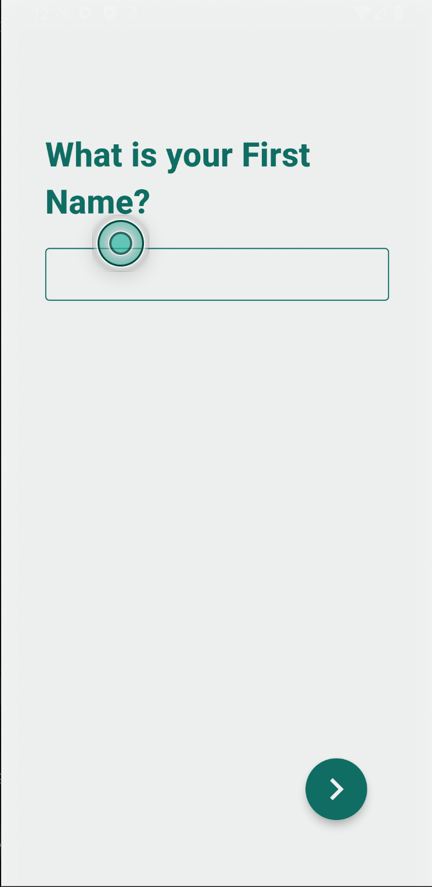
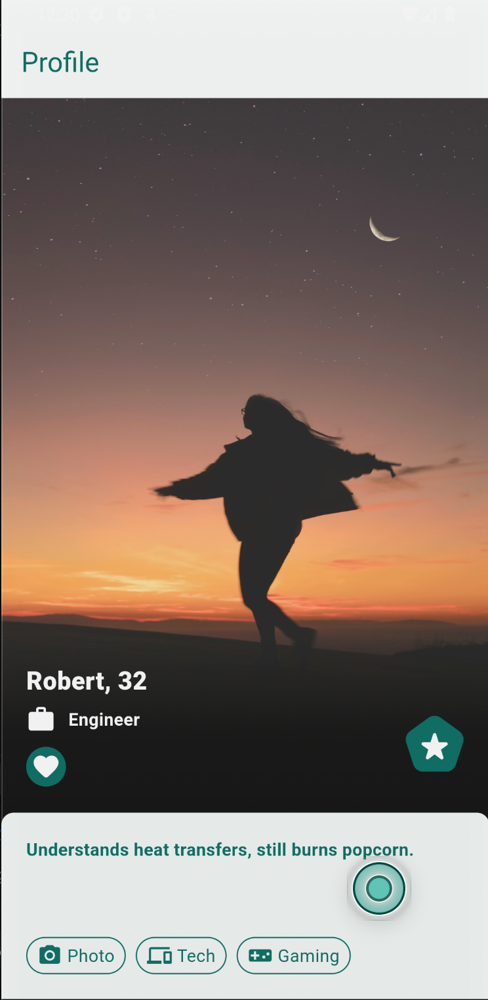

# Flutter Profile Builder

Flutter Profile Builder is a Flutter application designed to help users create their profiles through a series of questions and then view their profile on a separate screen.

## Features
- Onboarding experience similar to [Bumble](https://www.theappfuel.com/examples/bumble_onboarding) for user profile creation
- Profile screen to view user information
- Theme switcher to customize the app's appearance

## Project Details
- State Management: No state management used; user input is directly passed to the profile page
- Animations: No animations used in the current version of the app
- Error Handling: Managed input validation without using a form

## Getting Started
To run this application, ensure you have Flutter installed on your machine. Clone this repository, navigate to the project directory, and run `flutter run` in your terminal.

## Screenshots

## Feedback
Feedback on this project is welcome! If you have any suggestions or improvements, please feel free to open an issue or submit a pull request.

